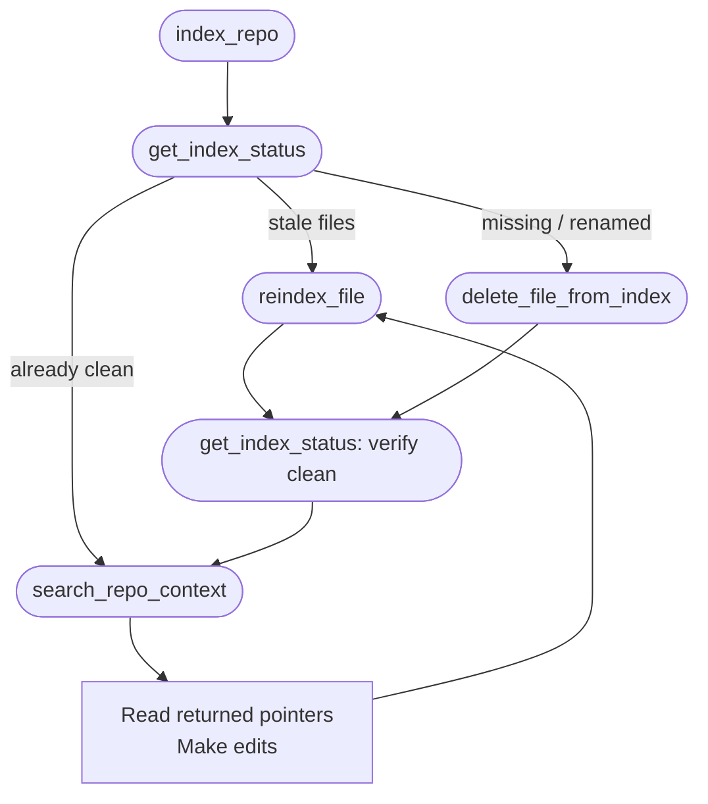

# codebase-indexer-mcp

A lightweight, local-first MCP server that gives Claude Code, Codex, and other
MCP-aware clients semantic search over a local repository — without an external
embedding service.

> [!NOTE]
> **Status: Personal-use v0.** Learning-oriented, not a production-grade
> CocoIndex replacement. The index accelerates context discovery; files on disk
> remain the source of truth.

## What it does

Point the server at a local repo and it exposes six MCP tools for the client to
drive an explicit, index-first workflow:

| Tool | Purpose |
| --- | --- |
| `index_repo` | Initialize a repository index (idempotent). |
| `get_index_status` | Read-only diff between the repo and the index; reports what to reindex or delete. |
| `reindex_file` | Re-embed a single created or edited file. |
| `delete_file_from_index` | Remove a deleted, renamed, or no-longer-indexable path. |
| `search_repo_context` | Semantic search over indexed chunks; returns file + line pointers. |
| `remove_index` | Tear down the local `.codebase-index/` for a repo (requires `confirm=true`). |

Index data lives entirely in a `.codebase-index/` directory inside the target
repo. Nothing leaves the machine — embeddings use ChromaDB's default local
embedding function.

## The index-first workflow

Agents (and humans) drive the tools in a fixed order so the index and the
working tree stay in sync. Full contract lives in [`AGENTS.md`](AGENTS.md).



## Requirements

- CPython 3.14.3 (see [`.tool-versions`](.tool-versions)). The free-threaded
  build is not supported: ChromaDB's `onnxruntime` dependency is unavailable
  for it on macOS ARM64.
- [Pipenv](https://pipenv.pypa.io/) for dependency management.

## Quickstart

```bash
pipenv install --dev
pipenv run pytest                 # unit + local integration suite
pipenv run pytest -m smoke        # opt-in end-to-end lifecycle smoke tests
```

Verify the server module loads:

```bash
PYTHONPATH=src pipenv run python -c "from codebase_indexer.server import mcp; print(mcp.name)"
```

There is no packaged CLI entry point yet; the FastMCP server is defined in
[`src/codebase_indexer/server.py`](src/codebase_indexer/server.py) and runs via
`mcp.run()` under `if __name__ == "__main__"`.

## Further reading

- [`AGENTS.md`](AGENTS.md) — the enforced index-first workflow agents follow when working in this repo.
- [`docs/FUNCTIONAL_SPEC.md`](docs/FUNCTIONAL_SPEC.md) — tool contracts, lifecycle rules, filesystem edge cases.
- [`docs/ARCHITECTURE.md`](docs/ARCHITECTURE.md) — design decisions and module boundaries.
- [`docs/steps/`](docs/steps/) — chronological implementation records and the incremental plan.
