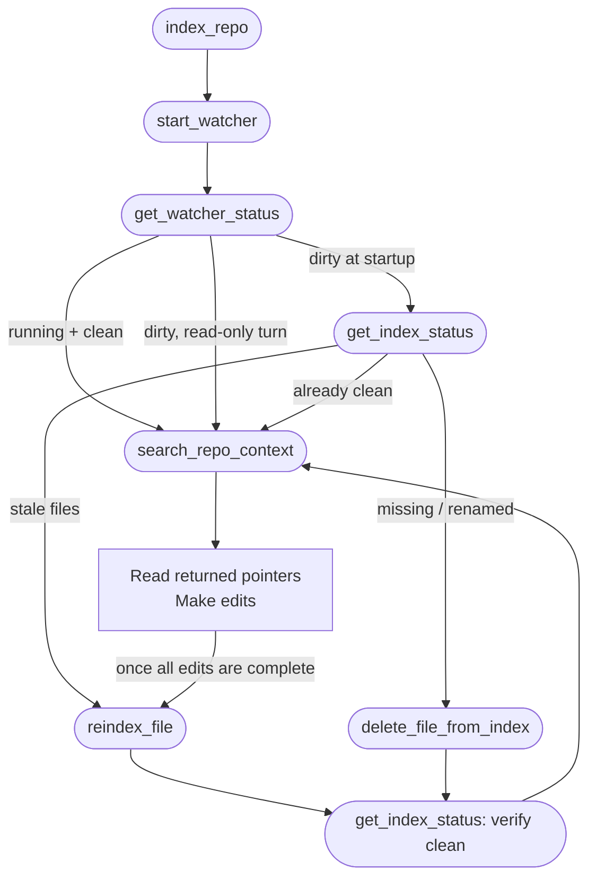

# codebase-indexer-mcp

A lightweight, local-first MCP server that gives Claude Code, Codex, and other
MCP-aware clients semantic search over a local repository — without an external
embedding service.

> [!NOTE]
> **Status: Personal-use v0.** Learning-oriented, not a production-grade
> CocoIndex replacement. The index accelerates context discovery; files on disk
> remain the source of truth.

## What it does

Point the server at a local repo and it exposes nine MCP tools for the client to
drive an explicit, index-first workflow:

| Tool | Purpose |
| --- | --- |
| `index_repo` | Initialize a repository index (idempotent). |
| `start_watcher` | Start the process-local change detector for one repository. |
| `get_watcher_status` | Cheaply read watcher state and the dirty signal without a status walk. |
| `set_index_dirty` | Maintenance override for the process-local dirty signal; outside the normal loop. |
| `get_index_status` | Read-only diff between the repo and the index; reports what to reindex or delete. |
| `reindex_file` | Re-embed a single created or edited file. |
| `delete_file_from_index` | Remove a deleted, renamed, or no-longer-indexable path. |
| `search_repo_context` | Semantic search over indexed chunks; returns file + line pointers. |
| `remove_index` | Tear down the local `.codebase-index/` for a repo (requires `confirm=true`). |

Index data lives entirely in a `.codebase-index/` directory inside the target
repo. Nothing leaves the machine — embeddings use ChromaDB's default local
embedding function.

## The index-first workflow

Agents (and humans) drive the tools in a fixed order so the index and the
working tree stay in sync. Full contract lives in [`AGENTS.md`](AGENTS.md).


```mermaid
flowchart TD
    A([index_repo]) --> W([start_watcher])
    W --> WS([get_watcher_status])
    WS -->|running + clean| F([search_repo_context])
    WS -->|dirty, read-only turn| F
    WS -->|dirty at startup| B([get_index_status])
    B -->|stale files| C([reindex_file])
    B -->|missing / renamed| D([delete_file_from_index])
    B -->|already clean| F
    C --> E([get_index_status: verify clean])
    D --> E
    E --> F
    F --> G[Read returned pointers<br/>Make edits]
    G -->|once all edits are complete| C
```

## What we found about token saving

**As it stands, this tool does not provide an advantage over `grep` /
`ripgrep`.** It was built to cut token usage relative to repo-wide text search,
and at v0 it does not achieve that. The findings are recorded here so they do
not have to be rediscovered.

**Indexing itself costs no LLM tokens.** Embedding runs locally and the server
reads the files, so file contents never enter the model's context. That part was
never the problem.

**The cost is tool-call round trips, and it scales with churn.** Reconciliation
is one `reindex_file` call per changed path, each a full inference pass, plus
the status calls that find them. That cost tracks how much changed since the
last clean status, not repository size, so a branch switch or a bulk formatter
is expensive in a way `rg` never is. `rg` has zero upkeep by construction.

**Net saving requires many discovery queries per reconciliation.** Upkeep is
paid per session; savings accrue per query. Typical sessions do not ask enough
discovery questions to clear that bar, and an agent given known file paths — the
common case — never needs the index at all.

**Search quality was not the bottleneck.** Conceptual queries did return the
correct file as the top hit, using vocabulary absent from the code. Two things
dilute the results: `docs/steps/` records compete semantically with the code
they describe and can take half the result slots, and 80-line chunks make each
"pointer" close to a whole-file read. Fixing both would sharpen the results
without changing the economics above.

**A small repository cannot demonstrate a saving.** At this size a repo-wide
`rg` is nearly free, so there is no headroom to win. A fair test would be a
large unfamiliar codebase with discovery questions and no paths supplied — the
round-trip arithmetic is what would have to change, not the search.

## Requirements

- CPython 3.14.3 (see [`.tool-versions`](.tool-versions)). The free-threaded
  build is not supported: ChromaDB's `onnxruntime` dependency is unavailable
  for it on macOS ARM64.
- [Pipenv](https://pipenv.pypa.io/) for dependency management.

## Quickstart

```bash
pipenv install --dev
pipenv run pytest                 # unit + local integration suite
pipenv run pytest -m smoke        # opt-in end-to-end lifecycle smoke tests
```

Verify the server module loads:

```bash
PYTHONPATH=src pipenv run python -c "from codebase_indexer.server import mcp; print(mcp.name)"
```

There is no packaged CLI entry point yet; the FastMCP server is defined in
[`src/codebase_indexer/server.py`](src/codebase_indexer/server.py) and runs via
`mcp.run()` under `if __name__ == "__main__"`.

## Further reading

- [`AGENTS.md`](AGENTS.md) — how agents use the indexer for context gathering, and the reconciliation they owe after edits.
- [`docs/FUNCTIONAL_SPEC.md`](docs/FUNCTIONAL_SPEC.md) — tool contracts, lifecycle rules, filesystem edge cases.
- [`docs/ARCHITECTURE.md`](docs/ARCHITECTURE.md) — design decisions and module boundaries.
- [`docs/steps/`](docs/steps/) — chronological implementation records and the incremental plan.
